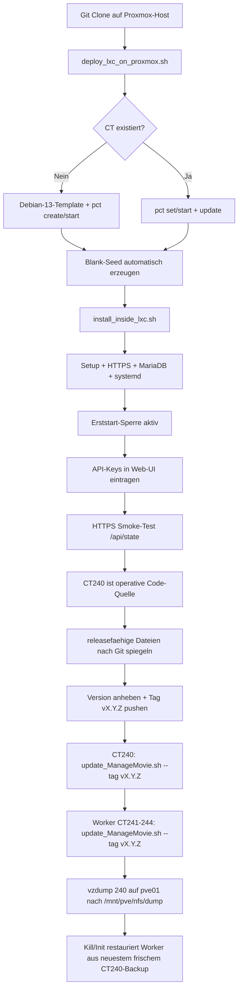

Version: 0.2.45

# ManageMovie LXS Flowchart

```mermaid
flowchart TD
  A["Git Clone auf Proxmox-Host"] --> B["deploy_lxc_on_proxmox.sh"]
  B --> C{"CT existiert?"}
  C -->|Nein| D["Debian-13-Template + pct create/start"]
  C -->|Ja| E["pct set/start + update"]
  D --> F["Blank-Seed automatisch erzeugen"]
  E --> F
  F --> G["install_inside_lxc.sh"]
  G --> H["Setup + HTTPS + MariaDB + systemd"]
  H --> I["Erststart-Sperre aktiv"]
  I --> J["API-Keys in Web-UI eintragen"]
  J --> K["HTTPS Smoke-Test /api/state"]
  K --> L["CT240 ist operative Code-Quelle"]
  L --> M["releasefaehige Dateien nach Git spiegeln"]
  M --> N["Version anheben + Tag vX.Y.Z pushen"]
  N --> O["CT240: update_ManageMovie.sh --tag vX.Y.Z"]
  O --> P["Worker CT241-244: update_ManageMovie.sh --tag vX.Y.Z"]
  P --> Q["vzdump 240 auf pve01 nach /mnt/pve/nfs/dump"]
  Q --> R["Kill/Init restauriert Worker aus neuestem frischem CT240-Backup"]
```
