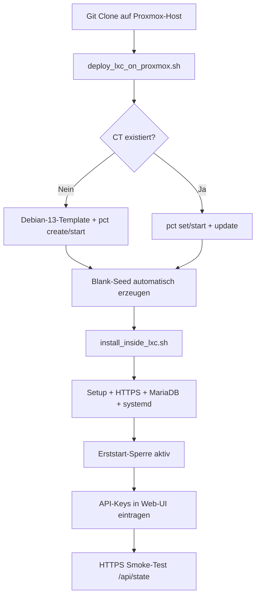

Version: 0.2.60

# ManageMovie LXS Flowchart

```mermaid
flowchart TD
  A["Git Clone auf Proxmox-Host"] --> B["deploy_lxc_on_proxmox.sh"]
  B --> C{"CT existiert?"}
  C -->|Nein| D["Debian-13-Template + pct create/start"]
  C -->|Ja| E["pct set/start + update"]
  D --> F["Blank-Seed automatisch erzeugen"]
  E --> F
  F --> G["install_inside_lxc.sh"]
  G --> H["Setup + HTTPS + MariaDB + systemd"]
  H --> I["Erststart-Sperre aktiv"]
  I --> J["API-Keys in Web-UI eintragen"]
  J --> K["HTTPS Smoke-Test /api/state"]
```
