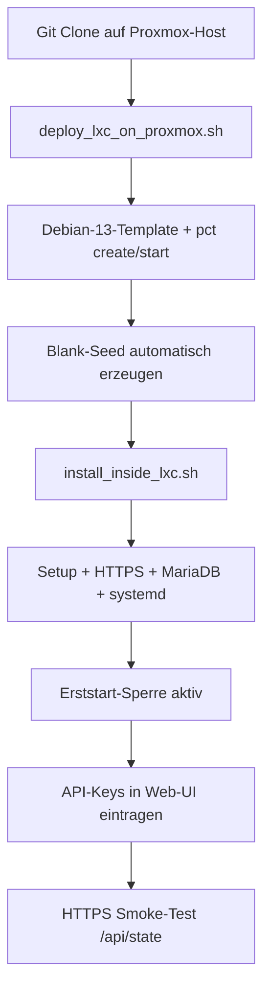

Version: 0.2.4

# ManageMovie LXS Flowchart

```mermaid
flowchart TD
  A["Git Clone auf Proxmox-Host"] --> B["deploy_lxc_on_proxmox.sh"]
  B --> C["Debian-13-Template + pct create/start"]
  C --> D["Blank-Seed automatisch erzeugen"]
  D --> E["install_inside_lxc.sh"]
  E --> F["Setup + HTTPS + MariaDB + systemd"]
  F --> G["Erststart-Sperre aktiv"]
  G --> H["API-Keys in Web-UI eintragen"]
  H --> I["HTTPS Smoke-Test /api/state"]
```
